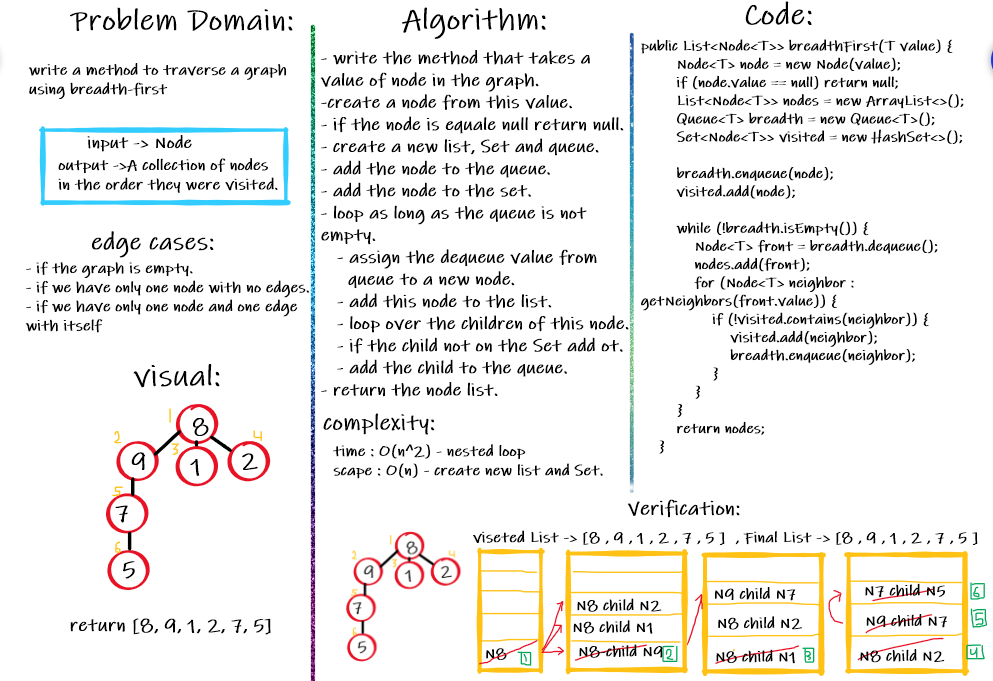

# Graphs

A graph is a non-linear data structure that can be looked at as a collection of vertices (or nodes) potentially connected by line segments named edges.

- Vetex: is a data object that can have zero or more adjacent vertices.
- Edge: is a connection between two nodes.
- Neighbor: The neighbors of a node are its adjacent nodes, i.e., are connected via an edge.
- Degree: The degree of a vertex is the number of edges connected to that vertex.

## Challenge

Implement your own Graph. The graph should be represented as an adjacency list, and should include the required methods.

## Approach & Efficiency

**add node**

- **Time** : O(1), no loops.

- **Space** : O(n), create node with children's list.

**add edge**

- **Time** : O(1), no loops.

- **Space** : O(1), no extra spaces.

**get nodes**

- **Time** : O(1), no loops.

- **Space** : O(1), no extra spaces.

**get neighbors**

- **Time** : O(1), no loops.

- **Space** : O(1), no extra spaces.

**size**

- **Time** : O(1), no loops.

- **Space** : O(1), no extra spaces.

## API

**add node**

- Arguments: value
- Returns: The added node
- Add a node to the graph

**add edge**

- Arguments: 2 nodes to be connected by the edge, weight (optional)
- Returns: nothing
- Adds a new edge between two nodes in the graph If specified, assign a weight to the edge Both nodes should already be in the Graph

**get nodes**

- Arguments: none
- Returns all of the nodes in the graph as a collection (set, list, or similar)

**get neighbors**

- Arguments: node
- Returns a collection of edges connected to the given node Include the weight of the connection in the returned collection

**size**

- Arguments: none
- Returns the total number of nodes in the graph

 

## Graphs Breadth-first

### Challenge

write a method to traverse a graph using breadth-first

- input -> Node

- output -> A collection of nodes in the order they were visited.

### Whiteboard Process

### Approach & Efficiency

- time : O(n^2) - nested loop

- scape : O(n) - create new list and Set.

## business trip

### Challenge

Write a function called business trip
Determine whether the trip is possible with direct flights, and how much it would cost.

- input -> graph, array of city names.

- output -> cost or null.

### Whiteboard Process

### Approach & Efficiency

- time : O(n) - 1 for loop.

- scape : O(1) - no extra spaces.

## Graphs Depth-first

### Challenge

write a method to traverse a graph using Depth-first.

- input -> Node

- output -> A collection of nodes in their pre-order depth-first traversal order.

### Whiteboard Process

### Approach & Efficiency

- time : O(n^2) - nested loop

- scape : O(n) - create new list and Set.
